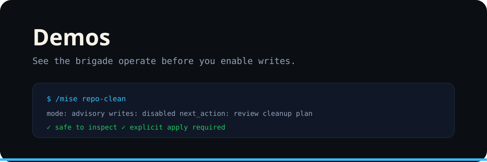

<p align="center"></p>

# Demos

Use demos to show the system without normalizing silent writes.

## Demo sequence

```bash
/mise issue-review
/mise comments-commits
/mise branch-corrections
/mise merge-pr
/mise repo-clean
```

For an apply-mode demo, state the intended mutation before executing it and show post-action verification immediately afterward.

## Demo contract

1. command received,
2. authority mode (`advisory` or `apply`),
3. evidence considered,
4. proposed or executed action,
5. final verification.
