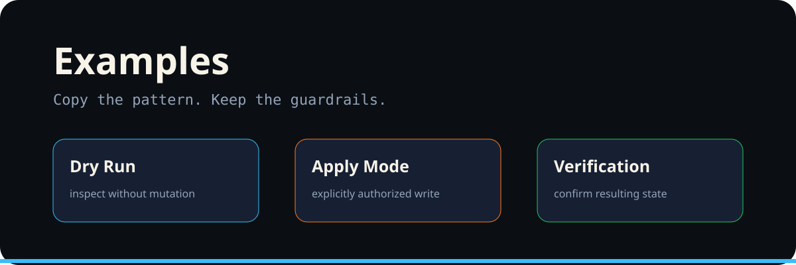

<p align="center"></p>

# Examples

## Dry run

```bash
/mise repo-clean
```

Expected posture: inspect repository health, report cleanup candidates, make no write.

## Explicit apply

```bash
/mise repo-clean apply
```

Expected posture: execute only the reviewed cleanup path and preserve an auditable trail.

## Merge readiness

```bash
/mise merge-pr
/mise merge-pr apply
```

## Branch correction

```bash
/mise branch-corrections
/mise branch-corrections apply
```

The pattern is deliberately repetitive: **inspect → review → authorize → verify**.
