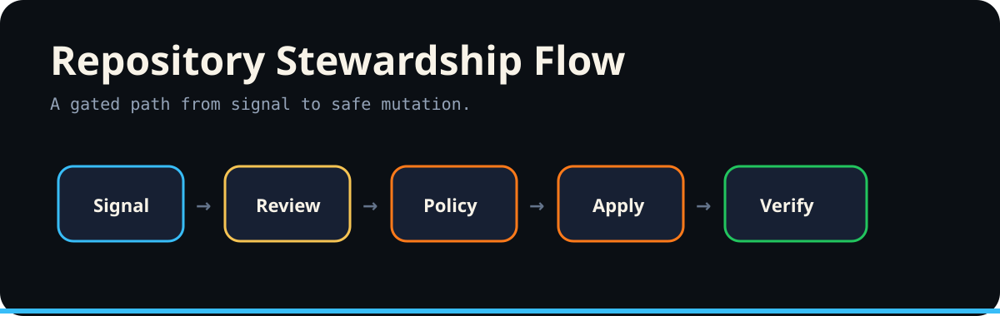

<p align="center"></p>

# Mise Branch Flow Corrections

Default branch: `main`

| Branch | Ahead | Behind | Open PR | Recommendation | Command |
|---|---:|---:|---|---|---|
| origin | 0 | 0 | none | Aligned | `git checkout origin && git pull --ff-only` |

## Exact base sync

```bash
git fetch --all --prune
git checkout main
git pull --ff-only origin main
```

Branch correction follows the repository-wide rule: inspect drift first, review the exact recommendation, apply only when authorized, then verify the resulting branch state.
