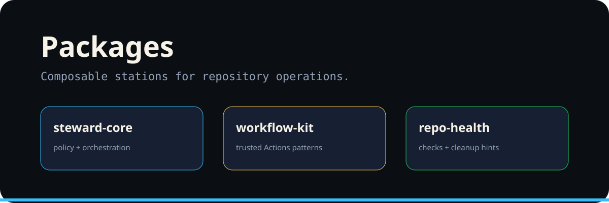

# Packages

The visual package model mirrors the operational architecture.

| Package concept | Responsibility |
|---|---|
| `steward-core` | Shared policy, orchestration, and state model. |
| `workflow-kit` | Trusted GitHub Actions and command-routing patterns. |
| `repo-health` | Repository checks, reports, and cleanup recommendations. |

Package boundaries should preserve least privilege: a reusable module should not inherit write authority merely because a caller has it.
