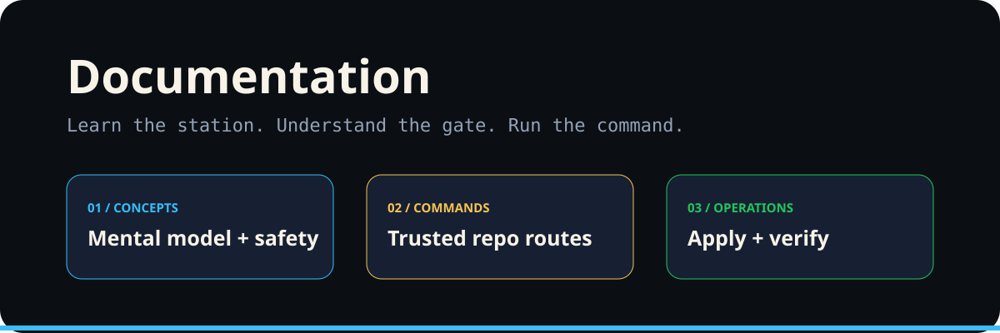

# Documentation

Mise Brigade de Repo treats repository operations like a disciplined kitchen brigade: each workflow has a station, policy is the pass, explicit `apply` is authorization to serve, and verification is the final quality check.

## Documentation map

| Guide | Use it for |
|---|---|
| [User Guide](USER_GUIDE.md) | First-run onboarding and the four-step operating loop. |
| [Safety Guide](SAFETY_GUIDE.md) | Permission boundaries and safe automation rules. |
| [Examples](EXAMPLES.md) | Copyable dry-run, apply, and verification patterns. |
| [Demos](DEMOS.md) | Demo-oriented walkthroughs of station commands. |
| [Packages](PACKAGES.md) | Composable package/station model. |
| [Releases](RELEASES.md) | Release communication and graphic usage. |
| [Branch Flow](MISE_BRANCH_FLOW.md) | Branch alignment and correction guidance. |
| [Action Stations](actions/README.md) | The five operational stations. |
| [Brand System](../brand/README.md) | Graphics, palette, accessibility, and asset placement. |

## Constitutional operating rule

> Inspect first. Explain the risk. Require explicit authority for mutation. Verify the resulting repository state.

The graphics reinforce the same semantics used by the workflows: blue for inspection/routing, gold for active work, orange for write authority, and green for a verified safe state.
