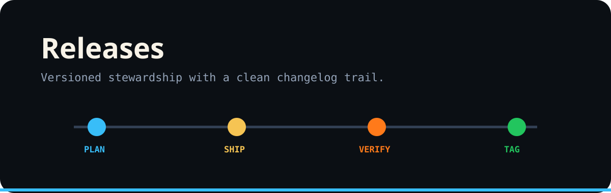

# Releases

Release communication follows the same operational rhythm: **Plan → Ship → Verify → Tag**.

## Release note structure

1. What changed.
2. Why the change exists.
3. Safety or permission impact.
4. Migration steps.
5. Verification performed.
6. Known limitations.

Use `brand/assets/svg/social-preview-1280x640.svg` as the source artwork for share/release cards. GitHub's repository Social preview control expects an uploaded raster image, so use the matching 1280×640 PNG export there after this PR lands.
