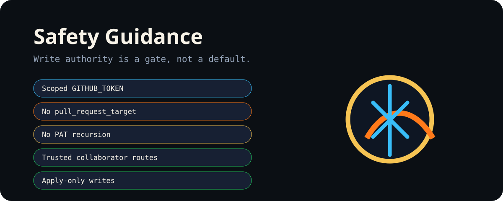

<p align="center"></p>

# Safety Guidance

The repository uses an advisory-first model. Read operations are the default; writes require explicit intent.

## Required boundaries

- Use `GITHUB_TOKEN` with job-level scoped permissions.
- Do not use `pull_request_target` to run untrusted fork code.
- Do not use PAT-driven recursion for generated repository actions.
- Keep trusted collaborator command routing explicit.
- Require `apply` before a workflow mutates repository state.
- Block automatic merge for fork PRs.
- Block automatic merge when workflow/action definitions change.
- Use `[skip ci]` on generated commits when appropriate to prevent recursive loops.

## Safety invariant

```text
detection ≠ authorization
recommendation ≠ mutation
successful write ≠ verified state
```

Every mutation should have an observable pre-state, explicit authority, a bounded write, and a verified post-state.
