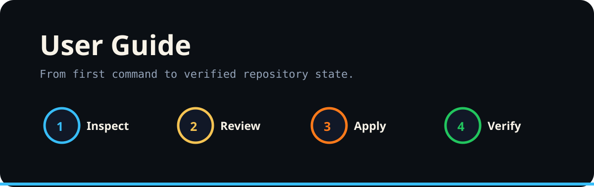

<p align="center"></p>

# User Guide

## 1. Inspect

Run the non-mutating command first.

```bash
/mise issue-review
/mise merge-pr
/mise branch-corrections
/mise comments-commits
/mise repo-clean
```

## 2. Review

Read the resulting context, branch recommendation, merge gate, or cleanup plan. Treat generated output as evidence for the next action, not automatic authorization.

## 3. Apply

Only use an `apply` form when the proposed mutation is intended.

```bash
/mise merge-pr apply
/mise branch-corrections apply
/mise comments-commits apply
/mise repo-clean apply
```

## 4. Verify

Confirm the branch, PR, workflow, and repository state after mutation. A successful command is not the same thing as a verified end state.

See [Safety Guidance](SAFETY_GUIDE.md) before enabling new write paths.
