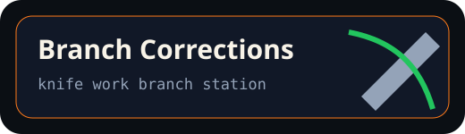

# Branch Corrections



## Station name

**Knife Work Branch Station**

## What it does

Finds branch drift, recommends the next exact branch to merge or clean, and blocks risky workflow/action changes.

## Command

```bash
/mise branch-corrections
/mise branch-corrections apply
```

## Manual trigger

```bash
gh workflow run "Mise Repo Steward" -f mode=branch-corrections -f apply_changes=true
```

## Learning value

This station teaches how branch flow becomes operational: compare, recommend, gate, then apply only when requested.

See [`COMPARE.md`](./COMPARE.md) and [`tools.json`](./tools.json).
